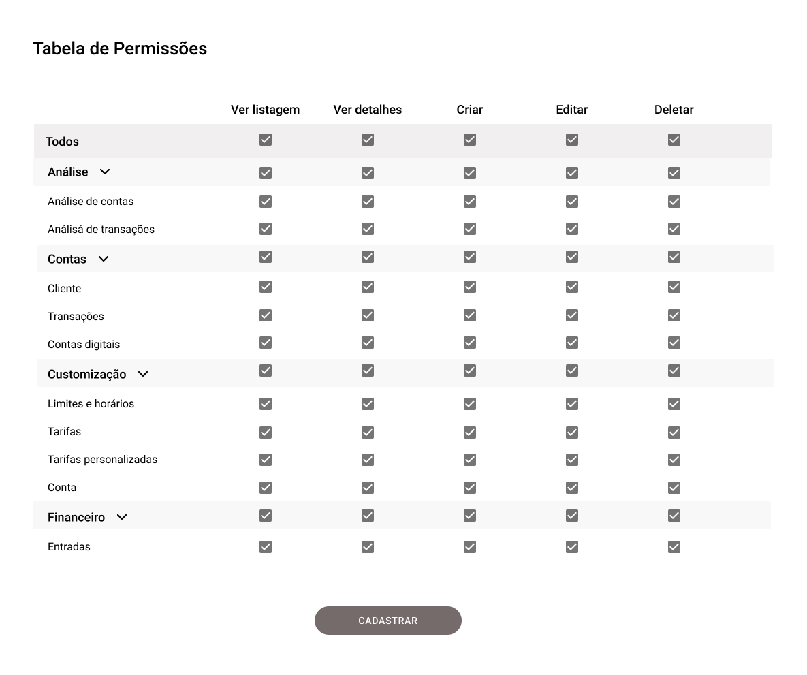

# Desafio Front end

O desafio tem como objetivo avaliar a pessoa candidata nas experiências: Criação de layouts, lógica aplicada e padrões no uso do React, tests com cypress. Vale lembrar que iremos avaliar tudo, mas não deixe de fazer a tarefa, pois conhecimento técnico é um dos pilares da Mobix e sabemos que conhecimento pode se adquirir.

### Requisitos

#### Obrigatório
- React hooks
- Test com Cypress

#### Opcionais
- Uso de framework de components: Ant Design, Bootstrap, Material UI
- Redux, Redux Saga
- Styled-components
- TypeScript

## Introdução

A Tabela de Permissões é uma funcionalidade para definir permissões internas do usuário que usa o sistema XPTO.

## Interações com o componente

Na tabela, temos 6 colunas sendo elas: Coluna vazia, Ver listagem, Ver detalhes, Criar, Editar e Deletar.

Obs: Analise, Contas, Customização e Financeiro representam os módulos (estão em cinza mais claro) e em branco são os submódulos.

1 - Na primeira linha da Coluna vazia é o Todos que representa a interação com todos os módulos abaixo (Analise, Contas, Customização e Financeiro). Ao clicar no checkbox de Ver listagem do item Todos, deve habilitar/desabilitar todos os checkbox abaixo (Analise, Contas, Customização e Financeiro) de ver listagem. Essa interação também deve ser seguida para Ver detalhes, Criar, Editar e Deletar.

2 - Na segunda linha da Coluna vazia é a Análise, esse item representa um módulo e ao clicar no checkbox do Ver listagem, deve habilitar/desabilitar o próprio checkbox e os abaixo que representam os submódulos (Analise de contas e Analise de transações). Essa interação também deve ser seguido para Ver detalhes, Criar, Editar e Deletar. E também deve ser seguido para os outros módulos.

3 - Na terceira linha da Coluna vazia é a Analise de contas, esse item representa um submódulo e ao clicar no checkbox do Ver listagem, deve habilitar/desabilitar o próprio checkbox e apenas isso. Essa interação também deve ser seguido para Ver detalhes, Criar, Editar e Deletar. E também deve ser seguido para os outros submódulos.

4 - É possível abrir e fechar a listagem de submódulos ao clicar na seta apontada para baixo. Ela indica para qual direção o componente terá o comportamento (abertura apontando para cima, fechamento apontando para baixo).

5 - Ao clicar no botão de cadastrar, deve aparecer no console log todas as permissões dentro de um array, ex: ["permissão1", "permissão2"] e etc.

Link para o Figma https://www.figma.com/file/bLdWjL7pxSdWde02icnhmX/Tabela-de-Permiss%C3%B5es?node-id=1%3A131